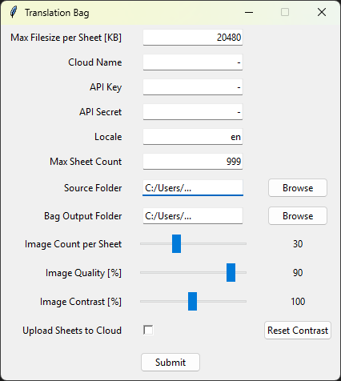

# TranslationBag

## Preview of GUI

Takes card images as input and creates a saved object for TTS as output that can be added to the mod's card index.

## Process

1) Make sure to have a local folder with the card images. The file names need to be either ArkhamDB IDs (e.g. 01001.jpg and 01001-back.jpg for Roland Banks) or set numbers if the files are in subfolders for each cycle (e.g. 01/001.jpg and 01/001-back.jpg).
2) Split the files by type and create a folder for each type (atm the only valid folder is 'PlayerCards').
3) Register on https://cloudinary.com/ (free). Get your API credentials. Alternatively, use local paths and upload to the steamcloud from inside TTS (Cloud Manager -> Upload All Loaded Files).
4) Run `main.py` (e.g. via console: `py main.py`) and fill in the data in the form.
5) The script will create a saved object in the correct folder for TTS to detect it.
6) Spawn it ingame, add the player cards to the "Additional Cards" box as well as the encounter cards to the "All Encounter Cards" box and you're good to go!
